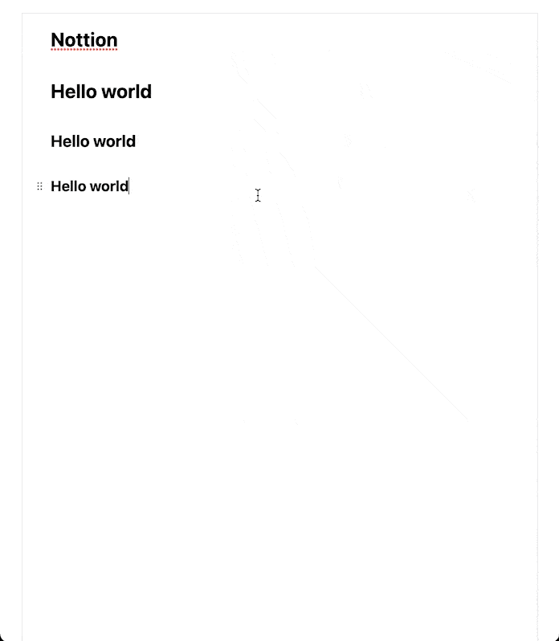

<h1 align="center">
        
</h1>

<a href="https://www.notion.so/">Notion</a> editor clone

## Table of Contents

- [Tech Stack](#tech-stack)
- [Features](#features)
- [Live](#live)
- [Demo](#demo)

## Tech Stack

- Next JS
- Slate JS & React Slate
- DND-Kit
- Tailwind

## Features

- Type "/" to show commands
  - Heading, paragraph, image, code, quote
- Text styling & shortcut
  - CMD + b → Bold
  - CMD + i → Italic
  - CMD + u → Underline
- Drag and drop

## Live

Live Demo: [Nottion](https://nottion.vercel.app/)

## Demo

| Flow                              | Demo                                            |
| --------------------------------- | ----------------------------------------------- |
| Heading 1                         |             |
| Heading 2                         |             |
| Heading 3                         |             |
| Paragraph                         |             |
| Image                             |                     |
| Code                              |                       |
| Quote                             |                     |
| Shortcut: bold, italic, underline |  |
| Drag and drop                     |         |
